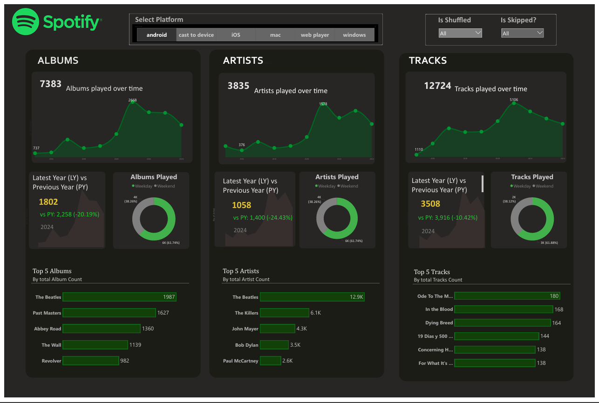
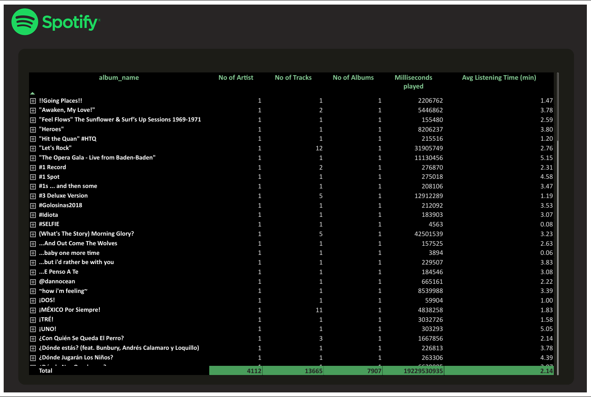
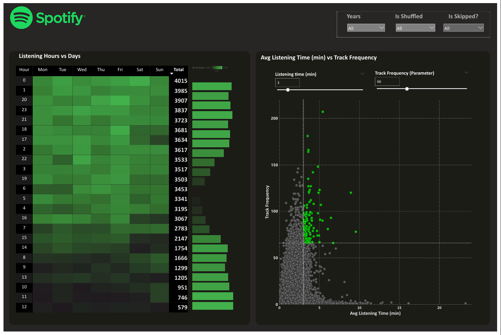

# SpotifyBI

# Spotify Listening Analysis 🎧

An Advanced Power BI dashboard project analyzing Spotify listening patterns over time — by albums, artists, tracks, and listening behavior.

## 🔍 Key Insights

- 📅 Listening trends by month & year  
- 🏆 Top 5 albums, artists, and tracks  
- 📈 Year-over-Year comparison  
- ⏰ Peak listening hours heatmap  
- 🎯 Track frequency vs listening time (quadrant view)  
- 📊 Interactive grid with drill-through & CSV export  

## 📂 Data Sources

The dataset includes user listening history from Spotify, covering albums, artists, tracks, time stamps, and engagement frequency.

## 🚀 Technologies Used

- Power BI (Visualization & Dashboard)  
- DAX (for calculated measures)  
- Excel / CSV (Data source)  
- Data Cleaning Tools (Power Query, Excel)  

## 📸 Dashboard Screenshots

  
  
  

> Screenshots located in the `/screenshots` folder.

## 📁 How to Use

1. Open `Spotify_Analysis.pbix` in Power BI Desktop  
2. Update data source path if needed  
3. Interact with filters, drill-downs, and export options  

